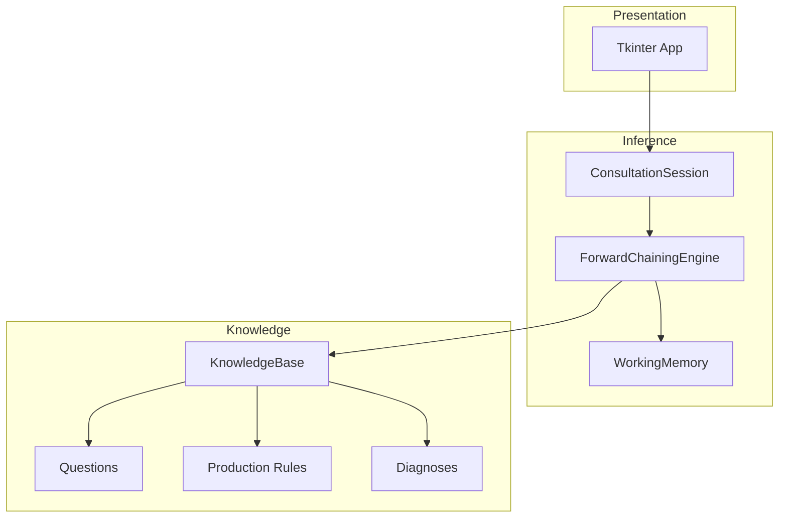

# Smart Troubleshooting Expert System

## 1. Project Title and Description

**Smart Troubleshooting Expert System** is an interactive **rule-based Knowledge-Based System (KBS)** that assists in diagnosing common **personal computer problems**. It captures user observations through a sequence of yes/no questions, maintains those observations as **facts** in **working memory**, and applies a set of **IF–THEN production rules** using **forward chaining** to reach a **diagnosis** together with recommended actions and an **explanation** of why that conclusion was drawn.

The system is designed for academic use in a **Knowledge-Based Systems** course: it separates **declarative knowledge** (what is known about symptoms and faults) from **procedural knowledge** (how to reason with that knowledge), and presents the consultation through a **graphical user interface (GUI)** built with **Python** and **Tkinter**.

**What the system does, in brief:**

- Guides the user through **one symptom question at a time**.
- Each answer **asserts a fact** (e.g. `NO_SIGNS_OF_LIFE`, `DISPLAY_HAS_PICTURE`).
- After every answer, the **inference engine** runs **forward chaining** until no new facts can be derived or a **terminal diagnosis rule** fires.
- The GUI displays the **problem**, **solution**, **explanation**, **matched rule conditions**, **fired rule identifier**, a **confidence heuristic**, and a **consultation trace** suitable for demonstration and marking criteria.

---

## Table of Contents

1. [Project Title and Description](#1-project-title-and-description)
2. [System Architecture](#2-system-architecture)
3. [Features](#3-features)
4. [How It Works (Step-by-Step)](#4-how-it-works-step-by-step)
5. [GUI Overview](#5-gui-overview)
6. [Installation & Running Instructions](#6-installation--running-instructions)
7. [Example Scenarios](#7-example-scenarios)
8. [Code Structure](#8-code-structure)
9. [Future Improvements](#9-future-improvements)
10. [Notes for Presentation](#10-notes-for-presentation)

---

## 2. System Architecture

The implementation follows a **layered architecture** typical of expert-system coursework: **domain model**, **knowledge base**, **inference engine**, and **presentation (GUI)**. Dependencies point inward: the GUI depends on a **consultation session** controller, which depends on the **engine** and **knowledge base**, not the other way around.



### 2.1 Knowledge Base

The **knowledge base** bundles three kinds of declarative content:

| Component | Role |
|-----------|------|
| **Questions** | Symptom acquisition: each question has **prerequisites** (facts that must already hold) and maps **Yes/No** to a **fact name** asserted into working memory. |
| **Production rules** | **IF** (conjunction of facts in working memory) **THEN** either assert a new **intermediate fact** (`FACT:...`) or conclude a **diagnosis key** (`DX:...`). |
| **Diagnoses** | A lookup table from diagnosis keys to structured conclusions: **problem**, **solution**, **explanation**, and optional **supporting hints** for the user. |

**Symbolic facts** (e.g. `SIGNS_OF_LIFE`, `PERFORMANCE_POOR`) are the vocabulary of the rule base. They are intentionally simple strings so the engine remains generic and the knowledge base remains easy to extend.

**Example production rules (as implemented in code):**

1. **Power / no LED (rule id `R1_POWER_NO_LED`)**  
   - **IF** `NO_SIGNS_OF_LIFE` **AND** `NO_POWER_LED`  
   - **THEN** `DX:DX_PSU_CABLE` → diagnosis: power supply or power delivery failure.

2. **Motherboard / PSU ambiguity after partial power signs (rules `R3` + `R10`)**  
   - **IF** `NO_SIGNS_OF_LIFE` **AND** `PSU_OR_MB_LED_ON` **AND** `FANS_SPIN_BRIEFLY`  
   - **THEN** `FACT:POWER_SUBSYSTEM_AMBIGUOUS` (intermediate fact).  
   - **IF** `POWER_SUBSYSTEM_AMBIGUOUS`  
   - **THEN** `DX:DX_MOTHERBOARD_SHORT` (escalation path).

3. **Display path after cable/monitor check (`R4_DISPLAY_AFTER_SWAP`)**  
   - **IF** `SIGNS_OF_LIFE` **AND** `DISPLAY_NO_PICTURE` **AND** `CABLE_OR_MONITOR_SWAPPED`  
   - **THEN** `DX:DX_DISPLAY_PATH`.

4. **Performance + disk (`R6_STORAGE_PERF`)**  
   - **IF** `SIGNS_OF_LIFE` **AND** `DISPLAY_HAS_PICTURE` **AND** `PERFORMANCE_POOR` **AND** `HEAVY_DISK_ACTIVITY`  
   - **THEN** `DX:DX_STORAGE_PERF`.

Rules are stored in `expert_system/knowledge/production_rules.py` and ordered explicitly; **rule order matters** when multiple rules could match in theory—the engine evaluates rules **in list order** and stops at the first **terminal diagnosis** fired in a cycle.

**Coverage areas** in the current KB:

- **Power** (no POST, LEDs, fans)  
- **Display** (black screen vs cable/monitor ruled out)  
- **Performance** (slow system, disk-heavy vs other causes)  
- **Thermal** (heat, noise, shutdowns when performance otherwise seems OK)  
- **Default “no strong fault pattern”** when symptoms are benign relative to the encoded rules  

---

### 2.2 Inference Engine (Forward Chaining)

**Forward chaining** is **data-driven** reasoning:

1. Start from **facts** currently in **working memory** σ.  
2. Scan the **rule base** for a rule whose **antecedents** are **all** contained in σ.  
3. If the consequent is `FACT:name`, **assert** that fact (if new) and **repeat** until no new facts appear in a full pass (**fixpoint**).  
4. If the consequent is `DX:id`, **bind** the corresponding **Diagnosis** object and **terminate** the chaining cycle for that consultation step (terminal conclusion).

This matches the classical **recognize–act** cycle: **recognize** applicable rules, **act** by asserting the consequent.

The class **`ForwardChainingEngine`** (`expert_system/inference/engine.py`):

- Owns a **`WorkingMemory`** instance (the fact store).  
- Accepts **observation facts** from user answers via `add_observation_fact`.  
- Exposes `run_forward_chaining()` which returns an **`InferenceResult`**: optional diagnosis, fired rule, human-readable **matched conditions**, **trace** lines, **derived facts**, and a **confidence** value derived from a simple **conjunction-size heuristic** (demo purposes, not medical-grade certainty).

**Working memory** (`WorkingMemory` in `working_memory.py`) provides `assert_fact`, `contains`, `contains_all`, and a sorted iteration view for the GUI.

---

### 2.3 Explanation Facility

Explanation is implemented at **three levels**:

1. **Structured diagnosis text** — Each `Diagnosis` includes `problem`, `solution`, and `explanation` prose.  
2. **Rule-level explanation** — Production rules may attach **`antecedent_labels`**: human-readable phrases for each symbolic fact in the antecedent set. When a rule fires, these appear as **“Matched conditions (antecedents)”** in the GUI.  
3. **Process explanation** — `ConsultationSession` maintains a **consultation log** of user assertions and **engine trace** lines (e.g. which rule asserted which fact or concluded which `DX` id). The right-hand panel shows **working memory** and this **log** for traceability.

Additionally, the GUI shows **which production rule id** fired (e.g. `R1_POWER_NO_LED`) and a **confidence percentage** explicitly described as a **heuristic** so evaluators understand its pedagogical role.

---

## 3. Features

- **Rule-based expert reasoning** with explicit **IF–THEN** production rules and symbolic facts.  
- **Forward chaining** inference with **fixpoint** iteration for intermediate `FACT:` consequents.  
- **Interactive consultation** — one question at a time; **Yes / No** only.  
- **Prerequisite-gated questions** — next question depends on facts already in working memory.  
- **Tkinter GUI** with a **modern dark theme**, large buttons, and clear typography.  
- **Split layout**: main consultation (left) and **reasoning trace** (right).  
- **Working memory display** (σ) — live list of asserted facts.  
- **Consultation log** — scrollable text of user answers and inference trace lines.  
- **Progress indicator** — bar and label summarising how many symptom questions have been answered relative to the KB size.  
- **Diagnosis panel** — scrollable sections for confidence, fired rule, problem, solution, explanation, and “why this conclusion”.  
- **Visual emphasis** — highlighted diagnosis region with a short **border pulse** animation.  
- **Restart consultation** — clears working memory and log and starts a new session.  
- **Separation of concerns** — knowledge, inference, and UI in separate packages; session controller mediates GUI and engine.  
- **No third-party dependencies** — Python standard library only (Tkinter, dataclasses, typing).  

---

## 4. How It Works (Step-by-Step)

The following describes the **internal workflow** from user input to final diagnosis.

1. **Application start**  
   - `main.py` adds the project directory to `sys.path` and launches `launch_app()` from `expert_system.presentation.app`.  
   - A **`KnowledgeBase`** is built via `default_knowledge_base()` (questions, rules, diagnoses).  
   - A **`ConsultationSession`** is created, which constructs a **`ForwardChainingEngine`** and empty **`WorkingMemory`**.

2. **Session reset / new consultation**  
   - Working memory is cleared; the consultation log receives an opening line.  
   - The GUI asks the engine for **`next_question()`**: the first **`Question`** whose **prerequisites** are satisfied and which is **not yet answered** (neither `yes_fact` nor `no_fact` is in memory).

3. **User answers Yes or No**  
   - The GUI calls `ConsultationSession.submit_boolean_answer(yes: bool)`.  
   - The session logs the question id and the asserted fact (e.g. `NO_SIGNS_OF_LIFE`).  
   - The fact is added to working memory through `add_observation_fact`.

4. **Forward chaining cycle**  
   - `run_forward_chaining()` loops until no rule adds a new `FACT:` or a `DX:` rule fires.  
   - Each assertion or conclusion appends to an internal **trace** list; the session copies trace lines into the **consultation log**.

5. **Branch A — No terminal diagnosis yet**  
   - `InferenceResult.diagnosis` is empty.  
   - The GUI refreshes working memory and log, then shows the **next** eligible question (again via `next_question()`).  
   - A short UI transition (dim / delay) may occur between questions.

6. **Branch B — Terminal diagnosis**  
   - A rule with consequent `DX:...` fires; the engine loads the corresponding **`Diagnosis`**.  
   - The GUI disables Yes/No, shows the diagnosis sections, updates confidence and **fired rule id**, and displays matched antecedent labels and hints.  
   - The user may **Restart** to run another scenario.

7. **End of consultation**  
   - If no question applies and no diagnosis fired (should be rare with a complete KB for the chosen branch), the UI indicates that no further questions apply and suggests restart.

---

## 5. GUI Overview

### 5.1 Layout

- **Header** — Project title and subtitle stating **forward chaining** and **production rules**.  
- **Left pane (main)**  
  - **Knowledge base title and description** (from `KnowledgeBase`).  
  - **Progress bar** and acquisition step label.  
  - **Question card** — phase line (e.g. symptom acquisition + question id), large question text, **Yes** and **No** buttons.  
  - **Diagnosis area** (when applicable) — scrollable canvas with sections: confidence, fired rule, problem, solution, explanation, why.  
  - **Restart consultation** button.  
- **Right pane (trace)**  
  - Short explanation of the trace panels.  
  - **Working memory (σ)** — list box of current facts.  
  - **Consultation log** — read-only scrolled text of events and inference steps.

### 5.2 User interaction

- Click **Yes** or **No** to answer the current question.  
- Observe the **right panel** updating after each step.  
- When a diagnosis appears, read the **scrollable** conclusion block; use the mouse wheel over the diagnosis area to scroll (when focused).  
- Click **Restart consultation** to clear state and begin again.

---

## 6. Installation & Running Instructions

### 6.1 Prerequisites

- **Python 3.10+** recommended (the codebase uses modern type syntax such as `tuple[...]` and `X | None` in some modules; Python 3.9 may work if your environment is configured consistently).  
- **Tkinter** must be available (included with most official Python installers on Windows; on some Linux distributions you may need the `python3-tk` package).

### 6.2 No pip install required

The project uses **only the Python standard library**. There is no `requirements.txt` dependency list because no third-party packages are required.

### 6.3 Running the application (step-by-step)

**English — step by step**

1. **Clone or copy** the project folder to your machine (e.g. `Smart Troubleshooting System`).  
2. **Open a terminal** (PowerShell, Command Prompt, or terminal on macOS/Linux).  
3. **Change directory** to the folder that contains `main.py`:

   ```bash
   cd "path/to/Smart Troubleshooting System"
   ```

4. **Run the program**:

   ```bash
   python main.py
   ```

   On some systems you may need:

   ```bash
   python3 main.py
   ```

5. The **GUI window** should open. If it does not, verify that Python can import Tkinter (e.g. `python -c "import tkinter"`).

**العربية — خطوة بخطوة (تشغيل المشروع)**

1. انسخ مجلد المشروع إلى جهازك أو استنسخه من مستودع Git.  
2. افتح **موجه الأوامر** أو **PowerShell** (أو الطرفية على لينكس/ماك).  
3. انتقل إلى المجلد الذي يحتوي على الملف `main.py` باستخدام الأمر `cd` مع مسار المجلد الصحيح.  
4. نفّذ الأمر:

   ```bash
   python main.py
   ```

   أو إن لزم:

   ```bash
   python3 main.py
   ```

5. تفتح نافذة الواجهة الرسومية؛ إن لم تفتح، تأكد من تثبيت Python مع دعم **Tkinter**.

---

## 7. Example Scenarios

Below are **three** representative paths. Exact wording on screen follows the strings in `questions.py` and `diagnoses.py`.

### Scenario A — Power delivery / PSU path

| Step | Your answer | Fact asserted (summary) |
|------|-------------|-------------------------|
| Q1: Any sign of life? | **No** | `NO_SIGNS_OF_LIFE` |
| Q2: Power LED on PSU/motherboard? | **No** | `NO_POWER_LED` |

**Outcome:** Rule **`R1_POWER_NO_LED`** fires.  
**Diagnosis (summary):** **Power supply or power delivery failure** — guidance to check outlet, cables, PSU switch, reseat motherboard power, consider PSU replacement.  
**Explanation cue:** No signs of life and no power LED → strong indication of power not reaching or failed PSU path.

---

### Scenario B — Display after cable/monitor ruled out

| Step | Your answer | Fact asserted (summary) |
|------|-------------|-------------------------|
| Q1: Any sign of life? | **Yes** | `SIGNS_OF_LIFE` |
| Q2: Monitor shows picture? | **No** | `DISPLAY_NO_PICTURE` |
| Q3: Tried different cable/monitor? | **Yes** | `CABLE_OR_MONITOR_SWAPPED` |

**Outcome:** Rule **`R4_DISPLAY_AFTER_SWAP`** fires.  
**Diagnosis (summary):** **Display output path issue** (cable, monitor, port, GPU chain).  
**Explanation cue:** System appears on but no picture even after swap → focus on video path / GPU / drivers / ports.

---

### Scenario C — Performance + heavy disk

| Step | Your answer | Fact asserted (summary) |
|------|-------------|-------------------------|
| Q1 | **Yes** | `SIGNS_OF_LIFE` |
| Q2 | **Yes** | `DISPLAY_HAS_PICTURE` |
| Q3: Unusually slow / freezing? | **Yes** | `PERFORMANCE_POOR` |
| Q4: Heavy disk activity? | **Yes** | `HEAVY_DISK_ACTIVITY` |

**Outcome:** Rule **`R6_STORAGE_PERF`** fires.  
**Diagnosis (summary):** **Performance bottleneck — storage or background load**.  
**Explanation cue:** Poor performance with heavy disk pattern → storage saturation, failing drive, or heavy I/O.

---

## 8. Code Structure

```
Smart Troubleshooting System/
├── main.py                          # Entry point; adjusts sys.path; launches GUI
├── README.md                        # This document
└── expert_system/
    ├── __init__.py                  # Package docstring / version
    ├── domain/
    │   ├── __init__.py
    │   └── models.py                # Diagnosis, Question, ProductionRule, KnowledgeBase
    ├── knowledge/
    │   ├── __init__.py              # Exports default_knowledge_base
    │   ├── default_kb.py            # Assembles KnowledgeBase instance
    │   ├── diagnoses.py             # DX_* diagnosis records
    │   ├── questions.py             # Symptom questions and fact mapping
    │   └── production_rules.py      # CORE_RULES + AMBIGUOUS_POWER_RULE, ordered_production_rules()
    ├── inference/
    │   ├── __init__.py
    │   ├── working_memory.py        # WorkingMemory class
    │   ├── engine.py                # ForwardChainingEngine, InferenceResult
    │   └── session.py               # ConsultationSession (log + submit_boolean_answer)
    └── presentation/
        ├── __init__.py
        ├── theme.py                 # Colours, fonts, ttk progress style
        └── app.py                   # TroubleshootingApp, launch_app()
```

### Main functions and classes (quick reference)

| Symbol | Location | Purpose |
|--------|----------|---------|
| `launch_app()` | `presentation/app.py` | Builds and runs the Tkinter main loop. |
| `TroubleshootingApp` | `presentation/app.py` | Full window layout, binds buttons to `ConsultationSession`. |
| `ConsultationSession` | `inference/session.py` | Orchestrates answers, logging, and calls to the engine. |
| `ForwardChainingEngine` | `inference/engine.py` | Forward chaining, `next_question()`, `run_forward_chaining()`. |
| `WorkingMemory` | `inference/working_memory.py` | Fact set operations. |
| `default_knowledge_base()` | `knowledge/default_kb.py` | Returns the default `KnowledgeBase`. |
| `KnowledgeBase` | `domain/models.py` | Container for questions, rules, diagnoses, metadata. |

---

## 9. Future Improvements

- **Richer knowledge** — More rules for laptops (battery vs AC), RAM errors, beep codes, network-only failures, and software-only faults.  
- **Certainty factors** — Attach numeric certainty to rules or facts (MYCIN-style) instead of a single conjunction heuristic.  
- **Backward chaining mode** — Optional goal-driven reasoning for comparison in coursework.  
- **Rule editor GUI** — Allow instructors to edit rules without touching code (with validation).  
- **Persistence** — Save/load consultations or export trace as PDF for reports.  
- **Internationalisation** — Arabic/English UI strings from resource files.  
- **Testing** — Automated tests that simulate answer sequences and assert expected diagnosis keys.  
- **Accessibility** — Keyboard navigation, high-contrast theme, screen-reader-friendly labels.  

---

## 10. Notes for Presentation

Use these **talking points** during a live demo:

1. **Define the problem** — “We built a **rule-based expert system** for PC troubleshooting, not a single `if/elif` ladder hidden in the UI.”  
2. **Show the separation** — Open `production_rules.py` and point to **antecedents** and **`DX:` / `FACT:`** consequents; emphasize that **knowledge is data**.  
3. **Explain forward chaining** — “After each answer we add a **fact** to **working memory**, then we **repeatedly scan rules** until we derive new facts or hit a **diagnosis**.”  
4. **Live trace** — Answer one or two questions and point to the **right panel**: facts appearing in **working memory** and lines in the **consultation log** matching the engine trace.  
5. **Explanation facility** — Scroll to **Matched conditions** and **Fired production rule** (e.g. `R1_POWER_NO_LED`) to show **how** the system justifies its answer.  
6. **Honesty about confidence** — State clearly that the **percentage** is a **pedagogical heuristic** based on rule size, not empirical probability.  
7. **Restart** — Demonstrate a **second scenario** (e.g. display path vs power path) to show **different rule firings**.  
8. **Limitations** — Mention **closed-world** assumption, **discrete facts**, and that real diagnostics may need hardware tests and professional service.  

---

## Academic integrity note

This project is intended as **coursework** for a Knowledge-Based Systems module. When submitting, cite any **external** sources or tutorials if you incorporate them beyond this codebase; the architecture and implementation described here match the repository structure as authored for the assignment.

---

*End of README.*
