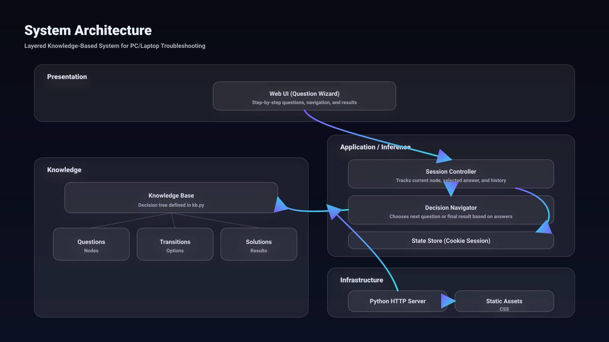

# StS — Smart Tech Support (Knowledge-Based System)

## Project idea (English summary)

StS is a lightweight **Knowledge‑Based System (Expert System)** for troubleshooting common **PC and laptop** issues.  
The user goes through a modern, step‑by‑step **question wizard**; each answer follows a predefined path in the **knowledge base** (a decision tree) until the system reaches a final outcome: a **probable diagnosis** and **practical, safe fix steps**.

The key design choice is separating the knowledge from the application logic: the decision tree and solutions live in `kb.py`, so you can expand the system by adding new questions and results without changing the server code.

## Architecture



## بريف عن الفكرة

`StS` هو **نظام خبير (Knowledge‑Based System)** لتشخيص مشاكل شائعة في الكمبيوتر واللاب توب.  
التطبيق بيشتغل كواجهة ويب حديثة (Wizard) بتسأل المستخدم **أسئلة بالترتيب**؛ وبناءً على الإجابات بيتم تتبُّع مسار في **قاعدة معرفة** (Decision Tree) لحد ما يوصل لـ **نتيجة نهائية**: تشخيص مُحتمل + خطوات حل عملية وآمنة.

الفكرة الأساسية إن “المعرفة” موجودة في قاعدة منفصلة (`kb.py`) سهلة التعديل، علشان تقدر تزود مشاكل/أسئلة/حلول بدون ما تغيّر منطق التطبيق.

## التشغيل

### تشغيل المشروع

شغّل السيرفر:

```bash
python server.py
```

وبعدين افتح:
`http://localhost:5173`

## تعديل قاعدة المعرفة

قاعدة المعرفة موجودة في `kb.py`:
- **`nodes`**: الأسئلة (سؤال + اختيارات + انتقال للسؤال التالي أو نتيجة)
- **`results`**: النتائج (عنوان + ملخص + خطوات حل)

## أفكار للتطوير
- إضافة إدخال “مش عارف” في أسئلة أكثر.
- حفظ الجلسة/تصدير تقرير PDF.
- إضافة “تحديد جهاز” (Desktop/Laptop) في البداية.
- إضافة Codes للأعطال مثل BSOD stop codes وتوصيات أدق.

